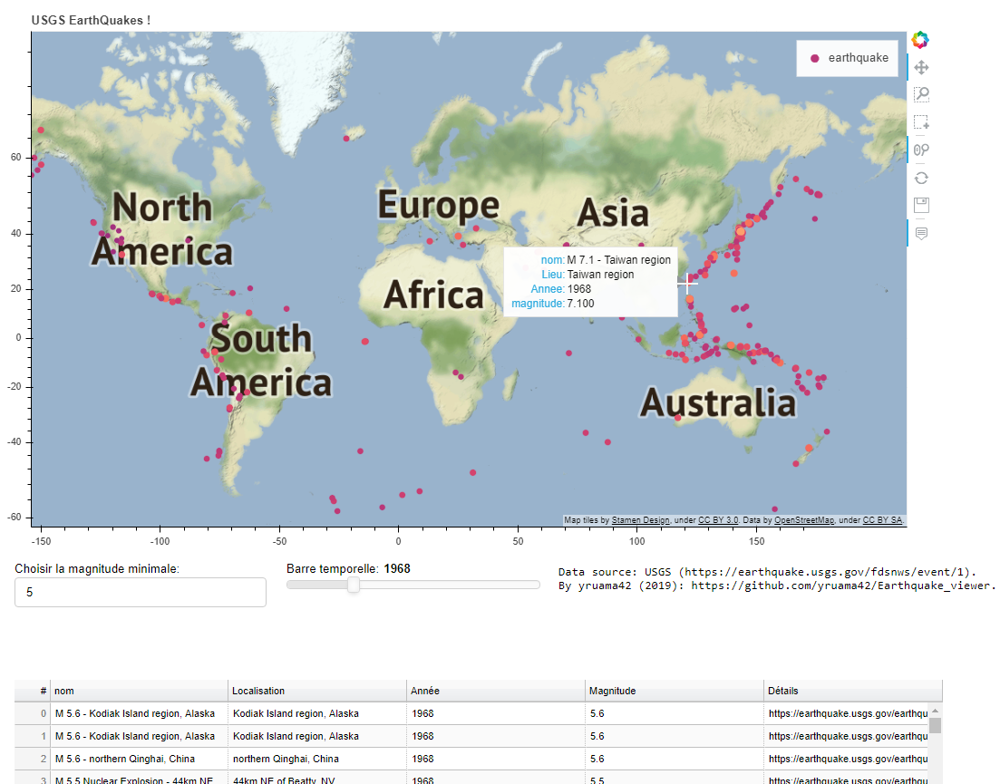

# USGS Earthquakes Viewer

## Data source
USGS [Earthquake Catalog](https://earthquake.usgs.gov/fdsnws/event/1)

## USGS Earthquakes Viewer on your browser - JavaScript version with Leaflet

[USGS Earthquake Viewer](https://yruama42.github.io/USGS_Earthquake_viewer/index.html)

## USGS Earthquakes Viewer on Heroku - Python version with Bokeh
Go to [USGS Earthquake Viewer](https://earthquakeviewer.herokuapp.com/main) on Heroku

## USGS Earthquakes Viewer on your computer

TODO

