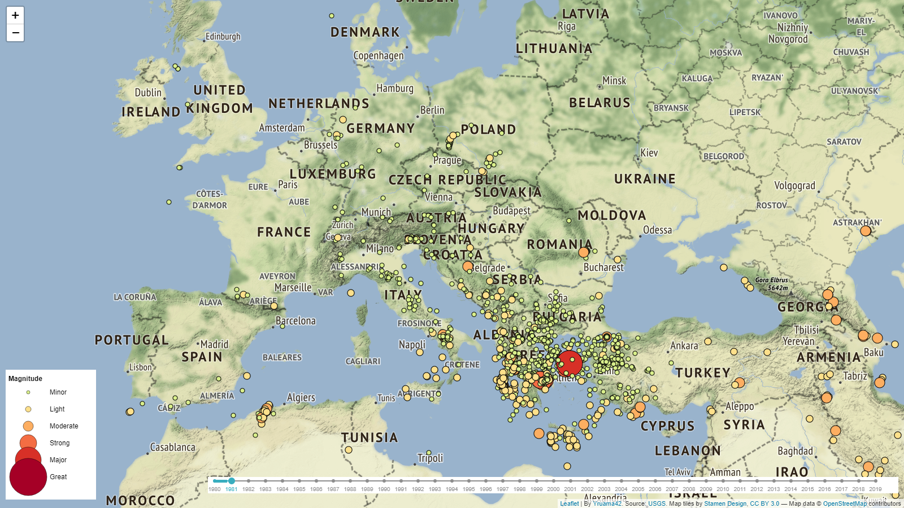

# USGS Earthquakes Viewer

## Data source
USGS [Earthquake Catalog](https://earthquake.usgs.gov/fdsnws/event/1)

## USGS Earthquakes Viewer on your browser - JavaScript version with Leaflet
[USGS Earthquake Viewer](https://yruama42.github.io/USGS_Earthquake_viewer/index.html)



## USGS Earthquakes Viewer on Heroku (free version.. takes time) - Python version with Bokeh
Go to [USGS Earthquake Viewer](https://earthquakeviewer.herokuapp.com/main) on Heroku


## USGS Earthquakes Viewer on your computer

### Installation

in your terminal Anaconda Prompt
```
conda create --name usgs_earthquake python=3.6 
conda config --add channels conda-forge
conda config --set channel_priority strict
conda install --file requirements.txt
activate usgs_earthquake
```

### run it

in your terminal Anaconda Prompt
```
bokeh server --show USGS_Earthquake_viewer
```


